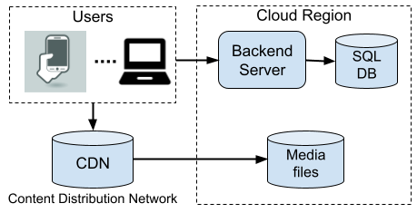
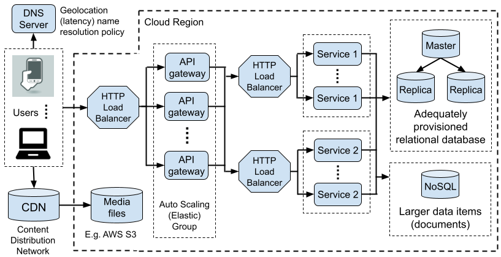
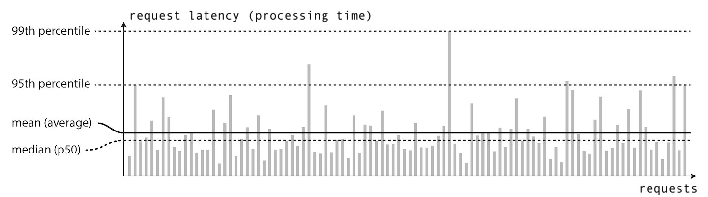
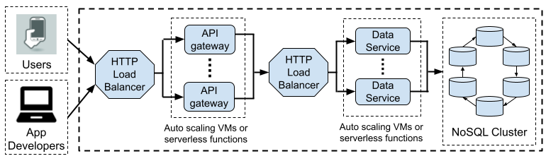
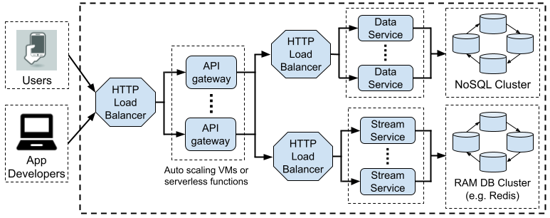

# Scalable and Reliable System Design Notes

Paulo Ferreira de Castro, October 2022

_Contents_

- [Scalable and Reliable System Design Notes](#scalable-and-reliable-system-design-notes)
  - [The Problems](#the-problems)
    - [Problem 1: The single-server backend (popular 50 years ago)](#problem-1-the-single-server-backend-popular-50-years-ago)
    - [Problem 2: Tail latency](#problem-2-tail-latency)
    - [Problem 3: The 500-million-user job interview question](#problem-3-the-500-million-user-job-interview-question)
  - [The Solutions](#the-solutions)
    - [Solution to Problem 1](#solution-to-problem-1)
    - [Solution to Problem 2](#solution-to-problem-2)
      - [***Idempotent requests***](#idempotent-requests)
      - [***Request identification***](#request-identification)
      - [***Hedged requests***](#hedged-requests)
      - [***Backoff and jitter***](#backoff-and-jitter)
      - [***Circuit breaker pattern***](#circuit-breaker-pattern)
      - [***Ambassador or sidecar patterns (Linkerd, Istio)***](#ambassador-or-sidecar-patterns-linkerd-istio)
    - [Solution to Problem 3](#solution-to-problem-3)
      - [***From ‘monthly active users’ to ‘HTTP requests per second’***](#from-monthly-active-users-to-http-requests-per-second)
      - [***Too expensive?***](#too-expensive)
      - [***Revisiting the problem***](#revisiting-the-problem)
      - [***Revised numbers***](#revised-numbers)
      - [***NoSQL Database provisioning***](#nosql-database-provisioning)
      - [***Backend hosting costs conclusion***](#backend-hosting-costs-conclusion)
      - [***Querying dashboard for app developers***](#querying-dashboard-for-app-developers)
      - [***Client side (mobile app) considerations***](#client-side-mobile-app-considerations)
      - [***Logging infrastructure API***](#logging-infrastructure-api)
      - [***Datacenter location(s) and data protection regulations***](#datacenter-locations-and-data-protection-regulations)

 

## The Problems

Assume a data-driven application with an increasingly large number of active users.

### Problem 1: The single-server backend (popular 50 years ago)

The following figure illustrates a trivial system architecture prescribing a single
powerful backend server machine and a single powerful relational (SQL) database machine.

<figure>
  
  <figcaption></figcaption>
</figure>

This architecture will face issues as the number of users grows:

- Scalability will be limited by the high cost or availability of a server machine
  with a sufficiently large amount of RAM memory, sufficiently high local CPU count,
  or sufficiently high bandwidth network interfaces.

  > _Scaling up by upgrading a machine’s hardware is known as **vertical scaling,**
  > and generally considered to be an approach that does not scale well._

- Similarly, a large number of simultaneous data-intensive requests will eventually
  overload a single-machine relational database.

- Single point of failure: A bug that only manifests occasionally (for example in the
  runtime environment like Node.js / Python interpreter / JVM, or even in the operating
  system kernel) may crash the only server and thus affect all client requests until the
  application or the whole server restarts. After a restart, any RAM memory cache needs to
  rebuilt, temporarily increasing latency.

How could the scalability and reliability of this architecture be improved?
 

### Problem 2: Tail latency

You did your homework and came up with a horizontally scalable architecture like the one
in the figure below:

<figure>
  
  <figcaption></figcaption>
</figure>

It generally works as intended. However, you come across a reliability (performance) issue
known as _tail latency,_ by which a small fraction of _successful_ requests suffers
significantly higher latency (processing time **within the cloud datacentre)** than the
median. For example, if the median latency (50th percentile or p50) was 50ms, the 99th
percentile (p99) latency might be 200ms, meaning that 1% of requests take more than 200ms
to be processed. The following figure illustrates such a scenario:

<figure>
  
  <figcaption></figcaption>
</figure>

After investigation, your team concludes that the explanation for the higher latency is
occasional network delays (not application-level errors) between the API gateways and
the data services (Service 1 and Service 2 in the figure above). The services themselves
and the databases are well provisioned and quickly process _all_ requests that reach them.
For the purpose of this exercise, accept that the delays are caused by the network
connections or the load balancers, and cannot or will not be fixed at that level (perhaps
because they are beyond your control or fit the datacenter’s SLA — Service-Level
Agreement).

The question is: what application-level changes could be made to the API gateways
and/or the data services (Service 1, Service 2) in order to reduce the p99 latency?
Hint: It involves retrying requests, but consider the potential pitfalls and any
off-the-shelf solutions to this problem.
 

### Problem 3: The 500-million-user job interview question

As Jackson Gabbard discussed in his YouTube video, [Intro to Architecture and Systems
Design Interviews](https://youtu.be/ZgdS0EUmn70?t=456):

> _Assume a multi-platform mobile application (e.g. Android and iOS) with 500 million
> monthly active users. How would you design a logging infrastructure for your app that
> makes it possible for the app developers to log any arbitrary event data from the app to
> the cloud backend, for events like e.g. “app started”, “app exited”, “feature X used”,
> “messages sent/received”, etc.?_

 

## The Solutions

### Solution to Problem 1

The solution to Problem 1 is a horizontally scalable architecture such as the one
depicted in Problem 2. Instead of a single physical server machine, the server code is
executed in multiple machines that can take one of several forms:

* Dedicated physical machines (expensive but possible, e.g. AWS EC2 Dedicated Hosts)
* Virtual machines (e.g. AWS EC2, Google Compute Engine, Azure Compute, etc.)
* Docker containers (e.g. Kubernetes, AWS EKS/ECS/Fargate, Google Kubernetes Engine, etc.)
* Serverless: Function as a Service (FaaS) (e.g. AWS Lambda, Google Cloud Functions, OpenFaaS)

Features like “auto scaling” or “elastic” instantiation of virtual machines (or other
compute units) mean that the number of server compute units can automatically increase or
decrease to match the client load through configurable metrics such as CPU / RAM
utilization, number of HTTP requests per minute, processing queue length, etc. A load
balancer takes care of distributing client requests across the available servers with
configurable policies.

The application logic may need to be modified to take into account that RAM memory is no
longer shared across all client requests. While “session stickiness” can be used to try
and always direct requests from a specific client to a specific server, this can lead to
suboptimal resource utilization and may introduce a reliability issue when an auto scaling
policy determines that a virtual machine should be terminated. The solution is to persist
and query data to/from a database during the processing of client requests, which may
include a mix of persistent storage and RAM-memory databases like Redis.

A relational database can be scaled with master-slave read replicas and, if needed,
master-master replication with an “eventual consistency” policy (e.g. MySQL 8.0 group
replication in multi-primary mode with [eventual transaction consistency
guarantee](https://dev.mysql.com/doc/refman/8.0/en/group-replication-configuring-consistency-guarantees.html)).
A NoSQL (not relational) database may additionally be employed to store immutable
documents, unstructured data, or to meet extreme write throughput requirements, with
careful consideration as to the potential loss of the data consistency guarantees of
relational databases (such as data types, constraint rules, non-null foreign keys, atomic
transactions, etc.).
 

### Solution to Problem 2

Problem 2 and the solution described below were inspired by Edward Wilde’s 2018 KubeCon &
CloudNativeCon [presentation](https://youtu.be/2EqkvPqk7JU) on how they used Linkerd to
improve their platform’s resilience.

The question indicates that the 1% of requests that take longer than 200ms to be processed
do not produce application-level errors (the requests will eventually succeed with a HTTP
200 status code), but their processing is delayed at the network level or by the load
balancers in front of the data services. The question hints at retrying requests as a
solution.

An initial solution would thus be to fine-tune request timeout and retries between the API
gateways and the data services. Assuming that the p50 = 50ms request processing time is
acceptable (within the datacentre), a timeout may be set at e.g. 75ms for HTTP requests
made by the API gateway to the data services. If the timeout expires, the request is
retried. If a retried request succeeded in 50ms, the total latency for that request would
be around 125ms, which is significantly lower than the p99 latency of 200ms.

To improve the latency even further, “hedged requests” may be used as described below.
Hedged requests have the potential to significantly reduce the gap between the p50 and
the p99 latency values.

Note that such retries at the API gateways are independent of any retries at the client
side, e.g. in a smartphone frontend. The client side is exposed to internet and local
network (WiFi) delays that are much larger and more variable than delays within the
datacentre.

#### ***Idempotent requests***

An obvious issue with timing out and retrying delayed requests that have not errored is
that it could lead to work duplication and data corruption. A POST HTTP request to append
some data at the end of a file must not be executed twice simply because the first request
is taking longer than the median latency. In this example, the solution might involve
changing the request semantics to include the file start and end offsets (indexes), such
that the data is written to that region of the file rather than appended to the end of the
file. This might also mean that the most suitable HTTP method changes from POST to PUT.
This way, if the same request is executed 2 or more times, the result would be the same.
Requests that may be executed multiple times without causing problems are known as
[idempotent](https://en.wikipedia.org/wiki/Idempotence).

On its own, idempotency addresses the problem of data corruption, but not that of work
duplication (wasted resources).

#### ***Request identification***

To address the issue of work duplication (wasted resources) that arises from retrying
requests, a request (or its content) could be uniquely identified and remembered, for
example through a combination of a request timestamp and a content hash.

Note that identifying and aborting duplicate requests makes sense at the data services,
_after_ the load balancers that are understood to be introducing delays. Duplicated
requests would not be aborted at the API gateways, which are in fact deliberately
introducing duplicate requests through retries.

If the application was already keeping an audit trail of every update to a resource (such
as a user account), the request identifier (timestamp + hash) could be included as part of
the audit trail and a SQL transaction could include conditional logic to check that the
identifier is not already present, rolling back the transaction if this condition was
violated.

To avoid the added strain of request ID querying (conditional transactions) on a
persistent SQL or NoSQL database, a memory database like Redis could be used for _data
service coordination_ (not API gateway coordination). Redis’ [SET
NX](https://redis.io/commands/set/) _atomic_ operation could be used to conditionally set
a key consisting of the request ID (timestamp + content hash). Before updating the
persistent database (SQL, NoSQL), a data service would attempt to set the key in Redis and
would observe the return value of the SET NX operation. If the operation indicated that
the key already existed, the data service would abort that request as a duplicate and
report this condition back in the reply to the API gateway. The SET NX key would be
created with an expiry time just above the request’s maximum time to live (above which the
request fails with an error), thus simplifying garbage collection.

Identifying requests and discarding duplicate requests as described above is NOT a
substitute for request idempotency in the general case. Requests retried by the client,
for example, would have different timestamps and thus different IDs. Also, if a RAM memory
database (Redis) was used for data service coordination and that database lost its memory
(perhaps during a rolling instance restart for a server upgrade), some duplicate requests
would not be detected.

#### ***Hedged requests***

Even if the API gateway decided to retry a request to a data service due to a configured
timeout, it should still listen to replies to either the original request or any retried
requests and use the first successful reply. This ties to the data service logic that
discards a request identified as a duplicate of a another request.

An extension of this concept is known as “hedged requests” - see Google article: [The Tail
at Scale](https://www.barroso.org/publications/TheTailAtScale.pdf). Instead of waiting for
a request to time out and then retry it, send the same request two or three times, all at
once, to different data services, and use the first valid answer. Depending on the cost of
processing the request, cancellation messages might be exchanged between the services in
order to reduce work duplication.

#### ***Backoff and jitter***

If work duplication is not avoided effectively (e.g. through request identification),
retrying requests can lead to data service or database overload. API gateways may not be
able to distinguish between a network-level (load balancer) delay and an overloaded data
service, for example just before additional data service instances are automatically
spawned in reaction to a client load spike.

Quickly retrying requests against a service that is already overloaded just exacerbates
the issue. At best it increases overall latency for all requests, and at worst it can lead
to a client-facing outage incident. To mitigate this issue, the retry logic should employ
backoff and jitter algorithms and a cap on the maximum number of retries, after which an
error is reported back to the client. An exponential backoff algorithm multiplies the last
timeout period by a constant (greater than 1) on every retry. Jitter is a random value
multiplied by or added to the backoff timeout period in order to introduce some delay
variability in each retry. This mitigates “request clustering” that happens when several
clients (API gateways) retry the requests at approximately the same time in reaction to
overloaded data services. An AWS Architecture Blog article, _[Exponential Backoff And
Jitter](https://aws.amazon.com/blogs/architecture/exponential-backoff-and-jitter/)_
([local
copy](pdf/Exponential%20Backoff%20And%20Jitter%20|%20AWS%20Architecture%20Blog.pdf)),
discusses these issues and a few different jitter approaches in more details.

#### ***Circuit breaker pattern***

In addition to backoff and jitter algorithms, the [circuit breaker design
pattern](https://learn.microsoft.com/en-us/azure/architecture/patterns/circuit-breaker)
can be used to allow a service (API gateway) to detect downstream service overload or
outage, and temporarily stop producing further requests until the issue is resolved.

When the API gateway detects a downstream overload condition, it responds to client
frontend requests with HTTP error codes such as 503 (Service Unavailable) or 504 (Gateway
Timeout), either immediately or after a configurable delay. Immediate error responses to
clients may not be desirable because substandard third-party frontends may also
immediately retry the requests, leading to an error loop that increases resource
utilization for both the backend and the frontend.

During a downstream outage, a circuit breaker implementation periodically probes the
downstream services to detect whether they have recovered in order to resume normal
request processing.

The circuit breaker pattern is not an answer to tail latency, but it is mentioned here
because it is usually implemented alongside request retry logic.

#### ***Ambassador or sidecar patterns (Linkerd, Istio)***

Backoff, jitter and the circuit breaker pattern are so common that off-the-shelf proxy
services are available to deliver these and other features. Examples include
[Linkerd](https://linkerd.io) and [Istio](https://istio.io). When these service daemons
are deployed alongside a service (such as the API Gateway in Problem 2), they implement
the so-called
[ambassador](https://learn.microsoft.com/en-us/azure/architecture/patterns/ambassador) or
[sidecar](https://learn.microsoft.com/en-us/azure/architecture/patterns/sidecar) patterns.
Other benefits include latency-aware load balancing and improved observability through
[integration with visualization platforms](https://linkerd.io/2.12/tasks/grafana/) like
[Grafana](https://grafana.com).

 

### Solution to Problem 3

As a reference and starting point, I would consider a horizontally scalable architecture
as the one illustrated below.

<figure>
  
  <figcaption></figcaption>
</figure>

#### ***From ‘monthly active users’ to ‘HTTP requests per second’***

Let’s clarify the meaning of “monthly active users” and how to get from there to a number
of HTTP requests per second at peak usage time (a basis for estimating backend capacity
and costs).

A monthly active user is a user who uses the platform at least once a month. This could be
5 minutes in a month, or 5 hours a day.

As Jackson Gabbard [explained](https://youtu.be/ZgdS0EUmn70?t=1181), a few arbitrary
assumptions need to be made. Let’s assume that:
- Most users are geographically concentrated in a few timezones.
- 70% of the monthly active users are also daily active users.
- 70% of the daily active users are also active during a peak usage hour.

Therefore:
- 70% of 500M: 350M daily active users
- 70% of 350M: 245M active users in a peak hour

But let me partially disagree with him when he then [further
calculated](https://www.youtube.com/watch?v=ZgdS0EUmn70&t=1213s) that 245M active users in
an hour means 245M / 3600s = 68K “concurrent users”, and he then proceeded to make
assumptions about how many concurrent users a Node.js backend server could handle.

I think there is some confusion there. Concurrent users are users who are using the
platform at the same time. Picture many users interacting with a mobile app at the same
time. If each peak-hour user (a user who uses the app during the peak hour) interacted
with the mobile app for the whole hour, then the number of concurrent users would be 245M,
not 68K. Also, directly dividing a number of users by 3600 seconds produces a puzzling
number of “users per second”. 🤔

What we are really after is the number of _logging HTTP requests per second_ that the
servers would need to handle. For this calculation, let’s further assume that **a
peak-hour app usage session issues 50 logging requests,** on average.

In this case:
- 245M active users = 245M usage sessions in the peak hour
- 50 logging HTTP requests per usage session, on average
- 245M * 50 = 12,250M logging HTTP requests in the peak hour
- 12,250M / 3600s = 3.4M logging HTTP requests per second

With these assumptions, the logging infrastructure would need to handle 3.4 million
logging HTTP requests per second.

#### ***Too expensive?***

Initially I went ahead with calculations for the required number of backend servers and
database capacity assuming 3.4 million logging HTTP requests per second during peak hours.

The peak number of API backend servers (e.g. running Node.js) would be large, but then a
few clever optimization tweaks could significantly reduce the numbers. For example, it
might be acceptable that the frontend grouped several logging events together,
compressed the data and sent it in a single HTTP request. Running several Node.js
processes in parallel ([cluster module](https://nodejs.org/api/cluster.html) or [worker
threads](https://nodejs.org/api/worker_threads.html)) would make the most of CPU and
networking resources in order to decompress and unbundle the logging requests before
database storage.

As for data storage, I believe that for it to allow useful querying of logged events by
developers (e.g. during an app debugging session), each logging event should be stored as
a separate item, for example in a NoSQL database. If the logging events were bundled
together and compressed and perhaps stored in binary data files in AWS S3, storage costs
would be lower but querying would get too complex or inefficient. This would need to be
demonstrated, but I think it is a reasonable assumption for this exercise.

If to store each logging event as a separate item, then 3.4 million logging requests per
second would mean 3.4 million database writes per second (at peak usage hours).
Technically this should be doable with off-the-shelf NoSQL databases like Cassandra or AWS
DynamoDB. For 3.4 million database writes per second, I roughly estimated the hosting
costs on AWS to fall in the **hundreds of thousands of dollars a month,** if not exceeding
a million dollars per month.

Is that too much money? Even if the company could afford it, it depends on the business
value gained from it. I think we could do better by taking a step back and revisiting the
problem statement.

#### ***Revisiting the problem***

The problem states that the purpose of the logging infrastructure is _“for the app
developers to log any arbitrary event data from the app.”_ Presumably this would help them
with debugging issues. But, to this end, is it really necessary to log events _from every
single one of the 245M active users during peak hours?_ Or indeed, from all 500 million
users who use the platform at least once a month. I think there would be a large amount of
repetitive, redundant, undifferentiated log data being recorded.

It is generally useful to collect data from a range of different usage scenarios, e.g.
connectivity (slow cellular _vs._ fast fibre), users’ technical skill (usage of advanced
features), changes in app default settings, etc. As such, a possibility would be to
conditionally collect logging depending on detected environment signals. But even in the
absence of targeted logging, a sufficiently wide range of usage scenarios might be covered
by, say, 10,000 randomly selected users, or 100,000 users or even 1 million users, the
latter consisting of 0.2% of the 500 million monthly active users.

In this situation, I would proceed by discussing some suggestions with the logging
infrastructure stakeholders, especially the app developers. For example:

* Log events of only 1% (or some other chosen fraction) of a randomly selected but stable
  set of app users. For example, the client app could apply a hash function on an
  immutable user ID to calculate a deterministic (stable) hash value reasonably evenly
  spread across all app users. This value could be mapped to a 0-100 range and if the
  result was less than 1.0 (assuming 1% of users), logging would be enabled for that user.
  Or some other algorithm along these lines. :)

* Log events of a greater fraction of users (more than 1%), but code the client app to
  selectively log “features of interest” (e.g. messaging, UI events, CPU usage, etc.) and
  “environments of interest” (e.g. geo locations, device data, user data, etc.) depending
  on some configuration retrieved from a backend API. This way, developers could
  temporarily enable focused logging. (In this case, ideally, the backend and database
  capacity would scale automatically to cope with it.)
  
* Have a ***live stream*** of logs that could be tapped, in addition to some persistent
  storage. For example, store in a database the logging events of only 0.1% (or some other
  chose fraction) of users on the basis that having some stored data is generally useful
  to app developers, and make additional logging available as a live stream that
  developers could tap and filter through a query system - a live stream query service
  provided by the logging infrastructure. This way, if developers were looking for
  specific logging data that they could not find in the database, they could leave a
  targeted live stream query running for some time (minutes, hours, days...) at
  significantly lower cost.

A live-stream log querying service could be implemented in various ways. The following
figure illustrates the use of a RAM memory database like Redis that could be used to
implement a capped-size circular buffer per query that could be used to aggregate log data
from multiple app users (arriving at the database through multiple API gateway instances)
and to provide best-effort download buffering for the live stream UI used by the app
developers. Alternative solutions include potentially queueing services like AWS SQS or
real-time data platforms like [Aerospike](https://aerospike.com).

<figure>
  
  <figcaption></figcaption>
</figure>

The enforcement of reduced logging (e.g. 1% of users) is most efficiently done on the
client side, but it is also required on the backend because:
  - If logic (code) changes were made to client logging, it would take some time for all
    clients to be updated on users’ phones.
  - On security grounds, it may not be safe to assume that only “official”, non-hacked
    clients can send requests to the backend (despite user authentication).
  - In case of live log streaming, further filtering is always required in the backend.

#### ***Revised numbers***

As argued above, I now assume that only the logs of 1% of active users will be captured,
with initial filtering performed by the mobile app. The numbers become:

- 1% * 245M = 2.45M active users in the peak hour
- 2.45M active users = 2.45M usage sessions in the peak hour
- 50 logging HTTP requests per usage session, on average
- 2.45M * 50 = 122.5M logging HTTP requests in the peak hour
- 122.5M / 3600s = 34K logging HTTP requests per second

Arbitrarily assuming that a Node.js API gateway could handle 10K HTTP requests per second,
we’d need a modest number of virtual machines:

- 10K req/s per virtual machine
- 34K / 10K = 4 virtual machines (rounded up)
- 34K / (80% * 10K) = 5 virtual machines at 80% utilization (to absorb minor spikes)

These numbers assume a simple implementation where each HTTP request carries a single
logging event. This could be improved by bundling several logging events together and
compressing the data in transit. However, in this infrastructure, the bottleneck in
performance and costs appears to be the persistent database, so I have not worried
much about optimizing it elsewhere.

#### ***NoSQL Database provisioning***

Two important metrics regarding NoSQL database provisioning and costs are:
  - Maximum throughput at peak usage time (maximum number of database reads and writes
    per second).
  - Total amount of stored data, e.g. average over a month or a quarter.

_Click on the arrows below to expand each section._

Throughput cost calculations - AWS DynamoDB

In the previous section, it was estimated that the platform would need to handle 34K
logging HTTP requests per second (from app users) that equal 34K logging events per second
at the peak usage time. Let’s assume that each logging event is less than 1KiB and equals
1 database write. In this case, we need to provision the database for 34K writes per second.

For AWS DynamoDB (AWS’s flagship NoSQL offering), the following throughput options can be
chosen from, with a significant difference in cost:

  - On-demand capacity: $1.25 per million write requests with slow-ish auto scaling to
    match usage spikes.
  - Provisioned capacity: $0.00065 per hour per WCU (Write Capacity Unit = 1 write request
    per second in this case). Auto scaling can dynamically adjust the pre-provisioned
    capacity (number of WCUs) for a database table.
  - Reserved capacity: like provisioned capacity, with an upfront payment and minimum
    usage commitments in exchange for a discounted hourly rate.

For the logging infrastructure, assuming the peak throughput of 34K writes per second and
further arbitrarily assuming:
  - Peak throughput (34K req/s) for 2 hours per day.
  - Average throughput of 17K req/s (50% of peak) at all other times.

The results from [AWS’s pricing calculator](https://calculator.aws/) are approximately:
  - ~ $110K per month with on-demand capacity.
  - ~ $8.7K per month with provisioned capacity.
  - ~ $5.5K per month + $12.7K upfront per year (works out overall as 6.5K per month)
    with 50% reserved capacity.

Regarding the _read_ throughput that would allow app developers to read log events from
the database, I assume that the usage pattern would be significantly different:
  - The database is only read when developers perform a query (apart perhaps from
    negligible processes such as status monitoring, tests in CI/CD pipelines, and such).
  - Developers would want to have high peak throughput while a query is performed,
    so that they can quickly extract the data they need.
  - Most of the time, while developers are not performing a query, the database would
    require negligible read throughput.

As such, assuming:
  - Peak read throughput of 200K reads per second, which means:
    - 200 MiB/s of logging data read for average log event size of 1KiB
    - 100 MiB/s of logging data read for average log event size of 0.5KiB
  - Peak read throughput usage for 3 hours per day on average, 22 days per month (Monday to Friday).

The read throughput cost result was ~ $900 per month, which is only 13% of the write
throughput cost ($6.5K).

 

Throughput cost calculations - Cassandra

For Cassandra’s costs I will rely on a Netflix TechBlog post: [Benchmarking Cassandra
Scalability on AWS — Over a million writes per
second](https://netflixtechblog.com/benchmarking-cassandra-scalability-on-aws-over-a-million-writes-per-second-39f45f066c9e).

In one of the configurations, they had 48 virtual machines running Cassandra nodes to
achieve a write throughput of 174K w/s (writes per second) with a replication factor of 3,
at a published cost of $33 per hour. They also published a scalability graph that shows
that the number of nodes scales linearly with the write throughput, so we could calculate
that for 34K w/s, we’d have:
  - 34K / 174K = 0.195
  - 0.195 * 48 nodes = 10 nodes (rounded up)
  - 10 / 48 * $33 = $7 per hour (AWS cost)
  - $7 * 24 * 30 = $5K per month (AWS cost)

Therefore, with Cassandra provisioned to handle a 34K w/s load 24 hours a day, the monthly
“throughput cost” would be lower than AWS’s DynamoDB (but see also data storage costs
below). I assume that the story would not be substantially different regarding the read
throughput, given that database reads could take advantage of the 3x replication factor,
but further investigation should be carried out to confirm this.

 

Data storage costs

A client-side (mobile app) budget of 50 logging HTTP requests per 5-minute usage session
was assumed, with a _maximum_ log event size of 500 bytes — see section [Mobile app
considerations](#client-side-mobile-app-considerations) for more details.

Combining those assumptions with a few new ones:

- Daily active users: 350M users
- 1% user sample (number of users): 0.1 * 350M = 3.5M users
- Avg usage sessions per day per user: 2 sessions
- Avg log requests per 5-minute usage session per user: 50 requests
- Avg log requests per day, sampled users: 3.5M * 2 * 50 = 350M requests
- Avg log request payload size: 200 bytes
- Avg log data storage per day: 350M * 200 = 70E+9 bytes
- Avg log data storage per day (GiB): 65.2 GiB
- Avg log data storage per month (TiB): 1.9 TiB
- Avg log data storage per quarter (TiB): 5.7 TiB
- Log data expiration in the database: 3 months

Therefore, assuming the numbers above and assuming that log data older than 3 months is
deleted, the database would store around 5.7 tebibytes of logging event data after 3
months of operation.

The results from [AWS’s pricing calculator](https://calculator.aws/) are approximately
**$1.5K per month for 6TiB of data.** This is on top of the throughput costs mentioned
in the previous sections.

For Cassandra, I am not completely sure how the data is allocated per node but assuming a
replication factor of 3 and a cluster of 10 nodes (virtual machines = VMs), I think the
5.7TiB would be spread across 3 groups of VMs, working out as 5.7 TiB / 3 = 1.9 TiB per
VM. The results from [AWS’s pricing calculator](https://calculator.aws/) for the Elastic
Block Store (EBS) service using 10 “General Purpose SSD (gp3)” disks of 2.2TB (2TiB) each
are approximately **$1.8K per month.** This is on top of the throughput costs mentioned
in the previous sections.

 

#### ***Backend hosting costs conclusion***

With the assumed parameters, the dominant hosting cost of the whole logging
infrastructure is by far the database that stores the log data, in particular the _write_
throughput that needs to meet peak app usage traffic. As such, to the extent that costs
may be an issue, this is where optimization efforts should be concentrated.

#### ***Querying dashboard for app developers***

App developers would require some tools to make effective use of the log data. Command
line interface tools and scripts would go a long way, while a web dashboard might be a
more friendly interface. Hopefully such tools and dashboard would not have to be written
from scratch. There are open source tools could be evaluated and modified to suit the
chosen database solution (e.g. Cassandra, DynamoDB, etc.). A web search has produced
some results:

  - https://logit.io/blog/post/open-source-logging-tools/
  - https://www.tek-tools.com/apm/best-free-log-analysis-tools
  - https://sematext.com/blog/log-analysis-tools/

Nonetheless, even simply adapting existing tools could still incur a significant software
development cost that would also have to be taken into account.

#### ***Client side (mobile app) considerations***

The previous assumption of an app developer “budget” of 50 HTTP logging requests per
5-minute usage session took into account the bandwidth (internet data traffic) impact on
mobile app users. Especially when not using WiFi, mobile data is often billed per megabyte
or gigabyte and users might be upset if the app significantly increased their data bills.
(Indeed, a discussion should take place on whether log events should only be sent over
WiFi.)

Assumptions:
  - Usage sessions of 5 minutes on average.
  - A budget of 500KiB (maximum) of logging data per 5min usage session.
  - 1 KB (max) per HTTP request including both payload and overhead:
    - 500 bytes overhead for network packet headers including JWT authentication
      token, cookies, etc.
    - Payload of 500 bytes maximum - the logging event data.
  - 1 logging HTTP request (to the backend) per log event.

With these assumptions and limitations, app developers would have some flexility on
the actual number of log request events per session or per minute:

Req/min | Payload (bytes) | Overhead (bytes) | KiB/min | KiB/hour
------- | --------------- | ---------------- | ------- | --------
8  | 500 | 500 | 7.81 | 469
10 | 350 | 500 | 8.30 | 498
12 | 200 | 500 | 8.20 | 492
16 |  30 | 500 | 8.28 | 497

As previously mentioned, there is room for optimizations such as compressing event data
and bundling several log events in a single HTTP request (which might then be larger than
1KB). Such optimizations are not included in the calculations above.

In the event that an internet connection is not available during a usage session, app
developers could consider saving the log events in local storage to be delivered later,
when an internet connection becomes available. It would be reasonable to limit the number
of saved log events to 50 — the budget of log events per usage session — and have saved
logs subject to the same expiration policy as the backend database, e.g. after 3 months if
not delivered. (There is no point in the client sending log events that will be
immediately discarded by the backend.)

Logging requests should of course be performed asynchronously (in the background), such
that UI responsiveness is not impacted. The impact on smartphone battery usage is
expected to be small.

#### ***Logging infrastructure API***

To store and retrieve log event data, a stateless REST API (HTTP + JSON) would be used.
The HTTP POST method is used to send a log event from the client to the server. The HTTP
GET method is used by developer querying tools to fetch log data by using a URL query
string to submit a filter expression to a backend service that would then translate it to
a database-specific query language such as Cassandra’s CQL, and then return a paginated
set of results.

For the log streaming service, the standard [Push API](https://w3c.github.io/push-api/)
could be used to keep the HTTP connection open while the server pushes log event data to
the query client, subject to sever-side filtering on a query expression.

Log event data would use the UTF-8 character set.

User authentication for the logging infrastructure would probably benefit from JWT (JSON
Web Tokens), so that the logging infrastructure can independently verify a digital
signature and avoid adding load to the main platform’s authentication service.

#### ***Datacenter location(s) and data protection regulations***

The client (mobile app) is expected to make logging HTTP requests asynchronously (in the
background), such that nothing is blocked waiting for a logging request to complete. As
such, request response time (latency) due to a user’s geographical distance to a
datacentre (physics, not politics - see below) is not a concern. From this perspective,
the logging infrastructure could be hosted in any one chosen datacentre in the world,
which simplifies the implementation.

Having said that:

* Data protection regulations _may_ require _certain_ data to be stored within the user’s
  jurisdiction. For example, the European Union’s GDPR _might_ require EU users’ log data
  to be stored in the EU. This _may_ depend on the log data containing information that
  could identify the user, and it _might_ be possible to anonymize the log data so as to
  satisfy the legal requirements without requiring a regional datacentre.

* National firewalls such as the [Great Firewall of
  China](https://en.wikipedia.org/wiki/Great_Firewall) sometimes cause _serious_ delays in
  HTTP requests, even measured in tens of seconds (from personal experience in a previous
  job), and sometimes broken TCP connections. As such, even in the absence of legal
  requirements or physics-bound response time concerns (e.g. “300ms is still OK”), some
  national firewalls may effectively require the use of a regional datacentre.

If it was necessary to store log data in multiple datacentres, a question arises regarding
the querying of the data. Moving the data across datacentres for the purpose of querying
it would probably fall foul of the regulations or reasons that required the data to be
stored regionally in the first place. It could also create significant data transfer
costs. It might be preferable and acceptable to require developer querying tools to
separately query logging data in each datacentre where it is stored. Otherwise, this would
require further discussion and investigation.
